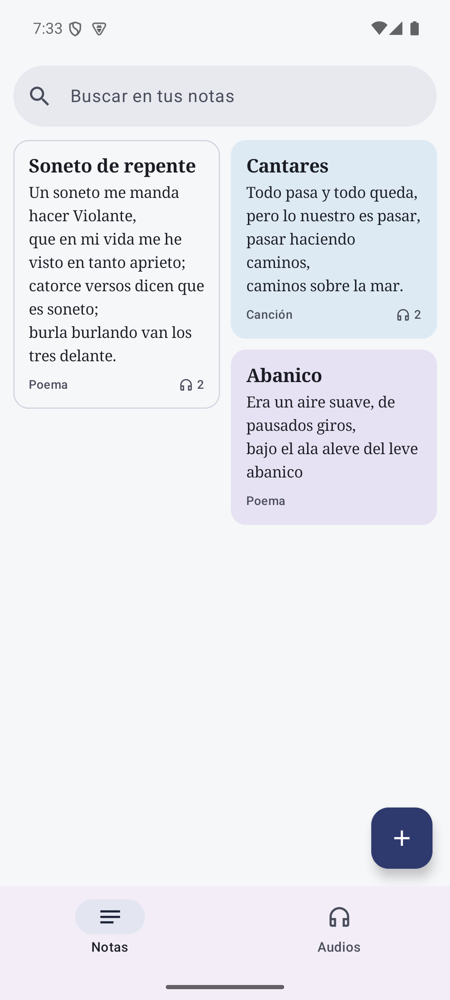
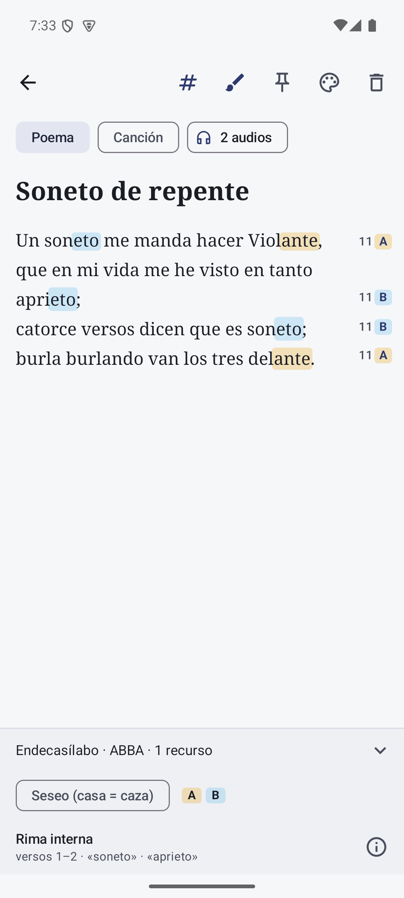
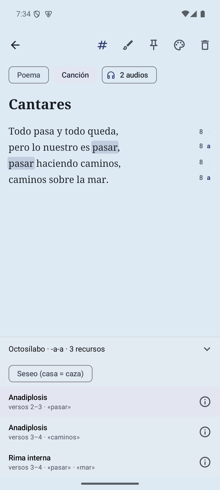
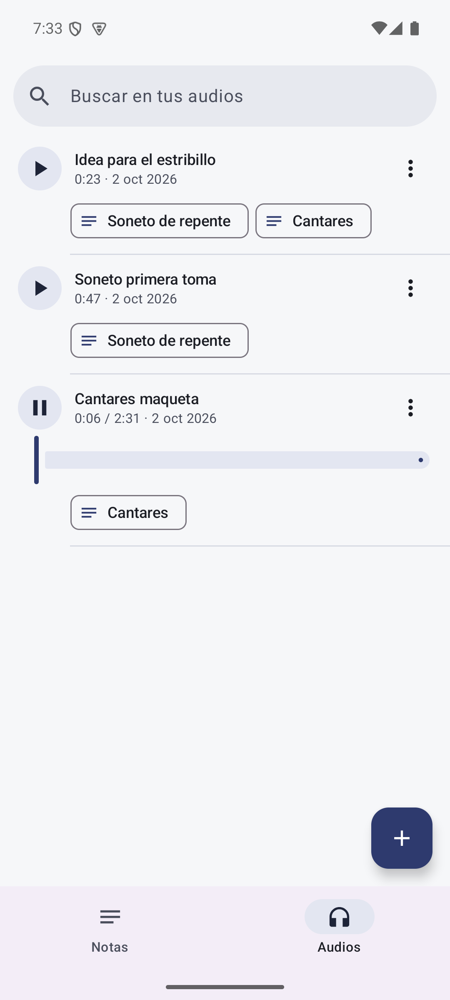
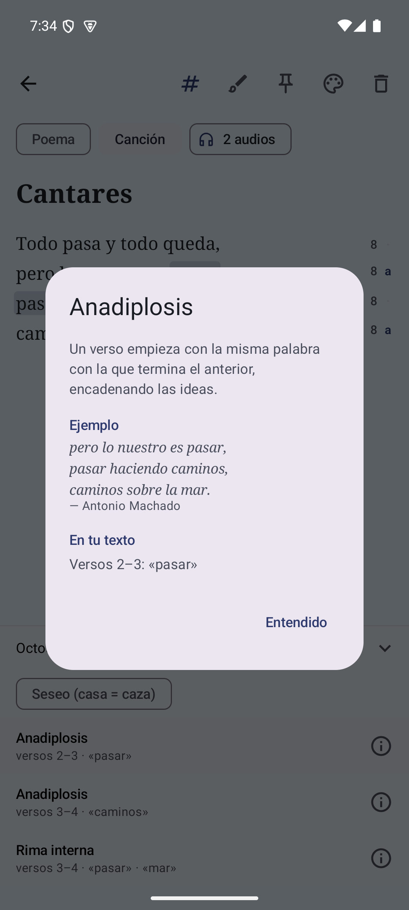
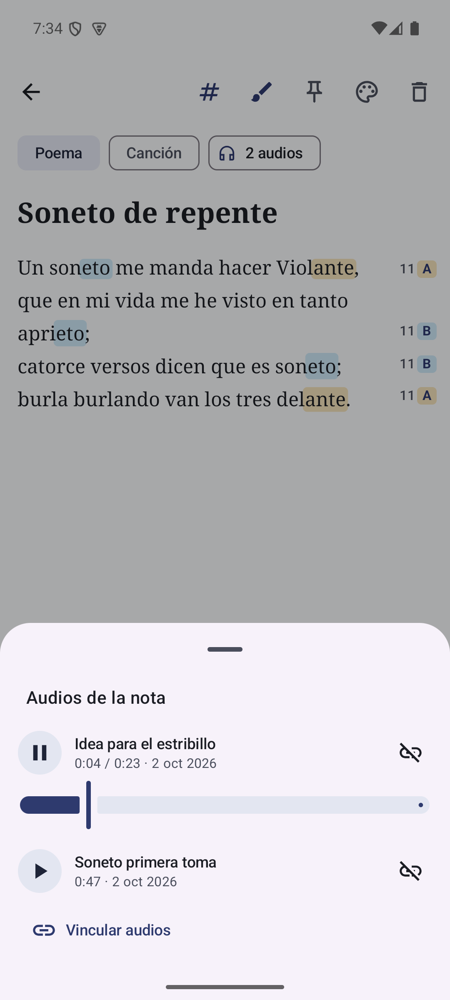
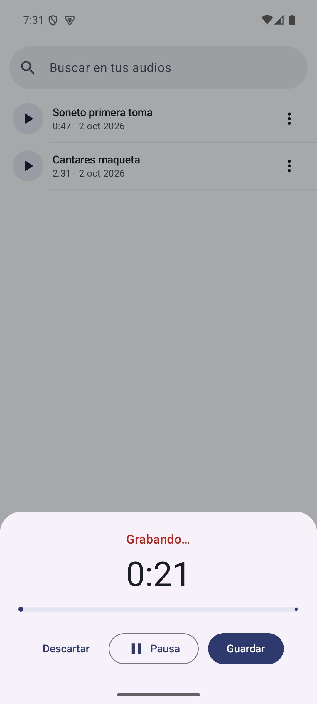

# Verso

[English](README.md) · **Español**

**Cuaderno de notas para Android pensado para escribir poesía y letras de canciones en español.**

Verso funciona como un Google Keep sencillo (notas en cuadrícula, colores, fijar, buscar), pero
con un rasgo propio: **analiza lo que escribes mientras lo escribes**. Cuenta las sílabas
métricas de cada verso, detecta el esquema de rima y señala recursos literarios como la
aliteración, la anáfora o el paralelismo. Además guarda **notas de voz y maquetas**: se graban
en la app o se adjuntan audios, y se vinculan a las notas a las que pertenecen.

<p align="center">
  
  
  
  
</p>
<p align="center">
  
  
  
  
</p>

## Qué hace

**Notas**
- Poemas y canciones como notas, con título, tipo (Poema / Canción) y uno de siete colores
  de papel (con variante nocturna).
- Fijar notas arriba, búsqueda por título y contenido, cuadrícula escalonada.
- Autoguardado: sin botón de guardar; una nota que se deja vacía se descarta.

**Audios**
- Una segunda sección, que se cambia desde la barra de abajo: **Notas** / **Audios**.
- **Grabar** ideas en la app (con pausa) o **adjuntar** audios del móvil (mp3, m4a, wav,
  ogg, flac…); los archivos importados se copian dentro de la app.
- Escucharlos ahí mismo con barra de avance, **cambiarles el nombre** y borrarlos.
- **Vincular** audios y notas, de muchos a muchos: una canción puede tener varias maquetas y
  una maqueta puede estar en varias canciones. El editor muestra los audios de la nota y las
  tarjetas un 🎧 con el número.
- Todo se queda en el móvil: los audios no se suben a ningún sitio.

**Análisis en tiempo real, en el editor**
- **Sílabas métricas** a la derecha de cada verso, ajustadas al metro dominante del poema
  (sinalefa, ley del acento final). Los versos que no encajan salen en rojo.
- **Rima**: letra de rima al margen (ABBA…), consonante y asonante, con equivalencias
  fonéticas (b = v, h muda, yeísmo) y **seseo** opcional para acento latinoamericano o andaluz.
  Minúsculas en arte menor (8 sílabas o menos).
- **Recursos literarios**: aliteración (clara o posible), anáfora, epífora, anadiplosis,
  epanadiplosis, geminación, polisíndeton, asíndeton, paralelismo, estribillo y rima interna.
  Al tocar uno se resaltan sus palabras y la pantalla se desplaza hasta él.
- Un **botón ⓘ** junto a cada recurso explica qué es, con un ejemplo clásico, dónde se ha
  encontrado y, en las aliteraciones, por qué cuenta como clara o posible.
- Resumen siempre visible: *«Endecasílabo · ABBA ABBA · 3 recursos»*.
- **Colorear rimas** (botón del pincel): cada grupo de rima tiene su color de rotulador en la
  terminación que rima, más suave en las asonantes; las rimas internas toman el color de su grupo.
- Se puede ocultar todo el análisis con el botón **#** de la barra superior.

## Descargar

La última versión firmada está en
[Releases](https://github.com/alvarocabrero/Verso/releases/latest): descarga el `.apk` en
el móvil y permite instalar apps de ese origen cuando Android lo pida.

Los cambios de cada versión están en el [registro de cambios](CHANGELOG.es.md).

## Requisitos

| | |
|---|---|
| Android | 8.0 (API 26) o superior |
| Compilación | JDK 17, Android SDK 35 |
| Lenguaje | Kotlin 2.0, Jetpack Compose (Material 3) |

## Empezar

```bash
git clone https://github.com/alvarocabrero/Verso.git
cd Verso
```

1. Crea `local.properties` con la ruta de tu SDK (Android Studio lo hace solo):
   ```properties
   sdk.dir=C:/Users/<tú>/AppData/Local/Android/Sdk
   ```
2. Compila e instala en un móvil o emulador conectado:
   ```bash
   ./gradlew installDebug
   ```
3. Ejecuta los tests del motor de análisis:
   ```bash
   ./gradlew testDebugUnitTest
   ```

El APK de depuración queda en `app/build/outputs/apk/debug/app-debug.apk`.
La guía completa del entorno (JDK, SDK, emulador en Windows) está en
[docs/es/development.md](docs/es/development.md).

## Estructura

```
app/src/main/java/com/tuapp/
  VersoApp.kt          Application: contenedor de dependencias (sin Hilt)
  MainActivity.kt      Navegación: inicio (notas / audios) y editor
  data/                Room (Note, Audio, NoteAudio, DAOs, VersoDatabase), repositorios y preferencias
  audio/               Grabador, reproductor y utilidades de formato de audio
  ui/home/             Pantalla principal con la barra de abajo
  ui/notes/            Sección de notas: búsqueda y cuadrícula de tarjetas
  ui/audios/           Sección de audios: lista, reproductor, grabación, importar, vínculos
  ui/editor/           Editor con autoguardado y análisis en tiempo real
  ui/theme/            Tema "tinta sobre papel", estilos de verso y paleta de notas
  analisis/            Motor de análisis en Kotlin puro (sin Android)
app/src/test/java/com/tuapp/analisis/   Tests JUnit del motor (57)
app/src/test/java/com/tuapp/audio/      Tests JUnit de las utilidades de audio (5)
docs/                  Documentación técnica en inglés (docs/es/: en español)
```

## Documentación

| Documento | Contenido |
|---|---|
| [Arquitectura](docs/es/architecture.md) | Capas, flujo de datos, autoguardado, hilos, navegación, audios (grabar, importar, vincular) |
| [Motor de análisis](docs/es/analysis-engine.md) | Silabeo, métrica, rima y recursos: reglas, algoritmos y API |
| [Editor](docs/es/editor.md) | Cómo se integra el análisis en la interfaz: margen, resaltado, panel |
| [Desarrollo](docs/es/development.md) | Entorno, compilación, tests, emulador, publicación, convenciones y resolución de problemas |
| [Registro de cambios](CHANGELOG.es.md) | Qué cambió en cada versión |

La versión en inglés de cada documento está en [docs/](docs/).

## Limitaciones conocidas

- No detecta diéresis ni sinéresis, ni la cesura de los alejandrinos.
- Un solo metro dominante por poema: en poemas polimétricos, los versos de otra medida
  aparecen en rojo.
- Las rimas internas solo se detectan si son consonantes; no hay "casi rimas".
- Los recursos semánticos (metáfora, símil, personificación…) no se detectan: haría falta
  un modelo de lenguaje.

## Hoja de ruta

- Grabar en segundo plano (con la pantalla bloqueada) y grabar directamente desde una nota.
- Etiquetas y papelera con deshacer.
- Exportar y compartir (texto, imagen).
- Metro por estrofa para poemas polimétricos.
- Detección opcional de recursos semánticos con un modelo de lenguaje.

## Convenciones

- El código de la app y los nombres de archivos y carpetas están en inglés.
- El motor de análisis (`analisis/`) conserva sus nombres en español, porque son términos
  de la métrica española (*sílaba*, *sinalefa*, *rima asonante*). No depende de Android y
  cada cambio en él va acompañado de tests.
- Todo lo que el usuario ve en la app está en español.

## Licencia

Verso es software libre, publicado bajo la [Licencia Pública General de GNU v3.0](LICENSE).
Puedes usarlo, estudiarlo, compartirlo y modificarlo; cualquier versión que se distribuya,
modificada o no, debe mantener la misma licencia e incluir su código fuente.
