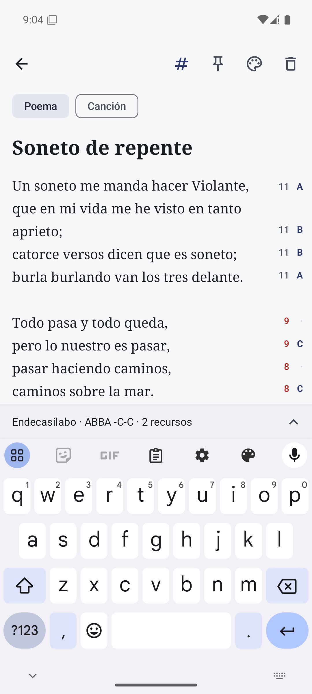
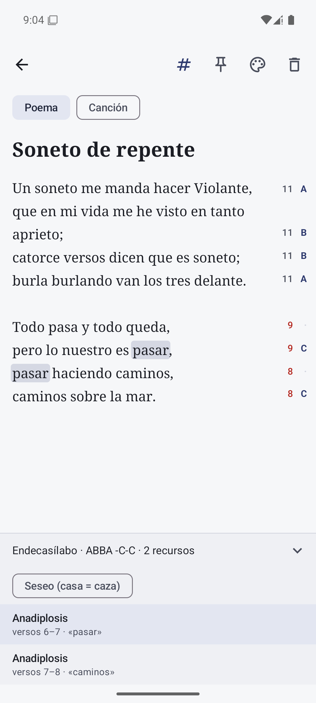
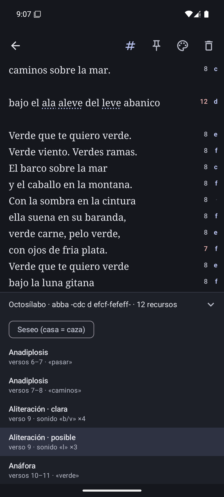

# Verso

**Español** · [English](README.en.md)

**Cuaderno de notas para Android pensado para escribir poesía y letras de canciones en español.**

Verso funciona como un Google Keep sencillo (notas en cuadrícula, colores, fijar, buscar), pero
con un rasgo propio: **analiza lo que escribes mientras lo escribes**. Cuenta las sílabas
métricas de cada verso, detecta el esquema de rima y señala recursos literarios como la
aliteración, la anáfora o el paralelismo.

<p align="center">
  
  
  
</p>

## Qué hace

**Notas**
- Poemas y canciones como notas, con título, tipo (Poema / Canción) y uno de siete colores
  de papel (con variante nocturna).
- Fijar notas arriba, búsqueda por título y contenido, cuadrícula escalonada.
- Autoguardado: sin botón de guardar; una nota que se deja vacía se descarta.

**Análisis en tiempo real, en el editor**
- **Sílabas métricas** a la derecha de cada verso, ajustadas al metro dominante del poema
  (sinalefa, ley del acento final). Los versos que no encajan salen en rojo.
- **Rima**: letra de rima al margen (ABBA…), consonante y asonante, con equivalencias
  fonéticas (b = v, h muda, yeísmo) y **seseo** opcional para acento latinoamericano o andaluz.
  Minúsculas en arte menor (8 sílabas o menos).
- **Recursos literarios**: aliteración (clara o posible), anáfora, epífora, anadiplosis,
  epanadiplosis, geminación, polisíndeton, asíndeton, paralelismo y estribillo.
  Al tocar uno se resaltan sus palabras y la pantalla se desplaza hasta él.
- Resumen siempre visible: *«Endecasílabo · ABBA ABBA · 3 recursos»*.
- Se puede ocultar todo el análisis con el botón **#** de la barra superior.

## Descargar

La última versión firmada está en
[Releases](https://github.com/alvarocabrero/Verso/releases/latest): descarga el `.apk` en
el móvil y permite instalar apps de ese origen cuando Android lo pida.

## Requisitos

| | |
|---|---|
| Android | 8.0 (API 26) o superior |
| Compilación | JDK 17, Android SDK 35 |
| Lenguaje | Kotlin 2.0, Jetpack Compose (Material 3) |

## Empezar

```bash
git clone https://github.com/alvarocabrero/Verso.git
cd Verso
```

1. Crea `local.properties` con la ruta de tu SDK (Android Studio lo hace solo):
   ```properties
   sdk.dir=C:/Users/<tú>/AppData/Local/Android/Sdk
   ```
2. Compila e instala en un móvil o emulador conectado:
   ```bash
   ./gradlew installDebug
   ```
3. Ejecuta los tests del motor de análisis:
   ```bash
   ./gradlew testDebugUnitTest
   ```

El APK de depuración queda en `app/build/outputs/apk/debug/app-debug.apk`.
La guía completa del entorno (JDK, SDK, emulador en Windows) está en
[docs/desarrollo.md](docs/desarrollo.md).

## Estructura

```
app/src/main/java/com/tuapp/
  VersoApp.kt          Application: contenedor de dependencias (sin Hilt)
  MainActivity.kt      Navegación: lista de notas y editor
  data/                Room (Nota, NotaDao, VersoDatabase), repositorio y preferencias
  ui/notas/            Pantalla principal: búsqueda y cuadrícula de tarjetas
  ui/editor/           Editor con autoguardado y análisis en tiempo real
  ui/theme/            Tema "tinta sobre papel", estilos de verso y paleta de notas
  analisis/            Motor de análisis en Kotlin puro (sin Android)
app/src/test/java/com/tuapp/analisis/   Tests JUnit del motor (48)
docs/                  Documentación técnica
```

## Documentación

| Documento | Contenido |
|---|---|
| [Arquitectura](docs/arquitectura.md) | Capas, flujo de datos, autoguardado, hilos, navegación |
| [Motor de análisis](docs/motor-de-analisis.md) | Silabeo, métrica, rima y recursos: reglas, algoritmos y API |
| [Editor](docs/editor.md) | Cómo se integra el análisis en la interfaz: margen, resaltado, panel |
| [Desarrollo](docs/desarrollo.md) | Entorno, compilación, tests, emulador, convenciones y resolución de problemas |

## Limitaciones conocidas

- No detecta diéresis ni sinéresis, ni la cesura de los alejandrinos.
- Un solo metro dominante por poema: en poemas polimétricos, los versos de otra medida
  aparecen en rojo.
- No hay rimas internas ni "casi rimas".
- Los recursos semánticos (metáfora, símil, personificación…) no se detectan: haría falta
  un modelo de lenguaje.

## Hoja de ruta

- Etiquetas y papelera con deshacer.
- Exportar y compartir (texto, imagen).
- Metro por estrofa para poemas polimétricos.
- Detección opcional de recursos semánticos con un modelo de lenguaje.

## Convenciones

Todo el código, los comentarios y la interfaz están en español. El motor de análisis no
depende de Android y cada cambio en él va acompañado de tests.
