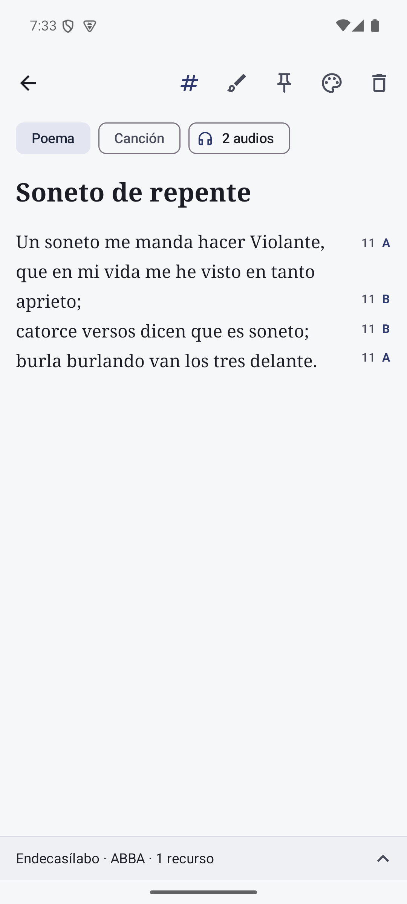
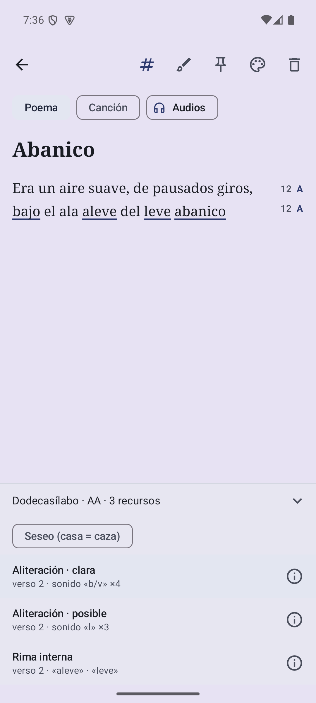
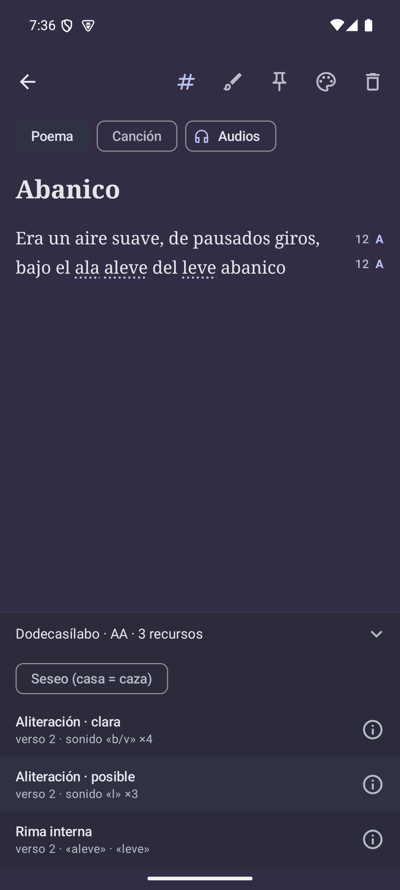

# El editor y el análisis en tiempo real

[English](../editor.md) · **Español**

Este documento explica cómo se muestra el análisis mientras se escribe. El cálculo en sí
está en [analysis-engine.md](analysis-engine.md); el ciclo de vida de la nota, en
[architecture.md](architecture.md).

<p align="center">
  
  
  
</p>

## Qué ve quien escribe

```
 ←                      #   📌  🎨  🗑
 [Poema] [Canción]
 Soneto de repente
 Un soneto me manda hacer Violante,        11  A
 que en mi vida me he visto en tanto
 aprieto;                                  11  B    ← verso partido: marca en su última línea
 catorce versos dicen que es soneto;       11  B
 burla burlando van los tres delante.      11  A
 ───────────────────────────────────────────────
 Endecasílabo · ABBA · 2 recursos          ˄        ← panel (se despliega)
```

- **Número**: sílabas métricas del verso ajustadas al metro dominante. En gris si el verso
  lo admite, en rojo (`colorScheme.error`) si no.
- **Letra**: grupo de rima, en el color primario. `·` apagado si el verso no rima con
  ninguno. Minúsculas en arte menor.
- **Panel**: resumen *metro · esquema · recursos*. Al tocarlo se despliega con el ajuste
  de seseo y la lista de recursos (tipo, *clara/posible* en aliteraciones, versos y
  evidencia). Tocar un recurso lo resalta y lleva la pantalla a su primer verso; tocarlo
  otra vez lo quita.
- **Botón ⓘ** en cada recurso: abre un diálogo con qué es el recurso, un ejemplo clásico
  (Darío, Machado, Bécquer, Lope, Lorca, Hernández…), dónde se ha encontrado en el texto
  y, en las aliteraciones, cuántas veces más de lo normal aparece el sonido y por qué
  cuenta como clara o posible. Los textos están en `ui/editor/DeviceInfo.kt`.
- **Botón #** (barra superior): muestra u oculta todo el análisis. Se recuerda entre
  sesiones.

## Componentes

Todos en `ui/editor/`.

| Composable / función | Archivo | Papel |
|---|---|---|
| `EditorScreen` | `EditorScreen.kt` | Estructura: barra, selector de color, tipo, título, versos, panel |
| `VerseEditor` | `AnalysisEditor.kt` | `BasicTextField` de los versos con margen, resaltado y cursor a la vista |
| `VerseMargin` | `AnalysisEditor.kt` | Sílabas y letra de rima alineadas con cada verso |
| `drawHighlight` | `AnalysisEditor.kt` | Fondo, subrayado o punteado bajo las palabras de un recurso |
| `AnalysisPanel` / `DeviceRow` | `AnalysisEditor.kt` | Resumen desplegable, seseo y lista de recursos |
| `DeviceInfoDialog` | `DeviceInfo.kt` | Explicación, ejemplo y detalles de la detección de un recurso |
| `highlightFor` | `AnalysisEditor.kt` | Traduce un `Recurso` a rangos y estilo de resaltado |

## Por qué un solo scroll

El título y los versos van dentro de una única `Column` con `verticalScroll`, y el campo
de versos **no tiene scroll propio** (crece con el texto). Así:

- el margen puede colocarse con las coordenadas del `TextLayoutResult` del campo, sin
  tener que seguir un segundo scroll interno;
- el título se desplaza con el poema, como en una hoja.

El precio es que Compose no lleva el cursor a la vista por sí solo en esta disposición.
`VerseEditor` lo resuelve a mano (ver [Cursor a la vista](#cursor-a-la-vista)).

El campo tiene una altura mínima de 320 dp para que se pueda tocar en cualquier punto de
la página aunque esté vacío.

## Alinear el margen

Cada `AnalisisPoema.Linea` sabe dónde empieza y acaba en el texto (`inicio`, `fin`). Con
el `TextLayoutResult` del campo:

```kotlin
val row    = layout.getLineForOffset(line.fin)   // última línea visual del verso
val top    = layout.getLineTop(row)
val height = layout.getLineBottom(row) - top
```

El margen se dibuja como una `Box` de 56 dp superpuesta a la derecha del campo (que tiene
ese mismo relleno a la derecha). Cada marca es una `Row` desplazada con
`offset { IntOffset(0, topPadding + top) }` y de altura `height`, centrada en
vertical. Usar `fin` y no `inicio` hace que en un verso que ocupa varias líneas visuales
la marca quede en la última, junto a la palabra que rima.

Cada marca tiene una descripción para lectores de pantalla: *"11 sílabas, rima A"* o
*"9 sílabas, no encaja en el metro"*.

## Análisis que va por detrás

El análisis llega 300 ms después de dejar de escribir, así que durante unos instantes
el resultado corresponde a un texto anterior. Para no dibujar marcas en sitios equivocados:

| Qué | Se muestra si… | Motivo |
|---|---|---|
| Margen | el resultado tiene **el mismo número de líneas** que el texto actual | Escribir dentro de un verso no mueve los versos; añadir o quitar líneas sí |
| Resaltado | el texto analizado es **idéntico** al actual | Los rangos son posiciones de carácter: cualquier cambio los desplaza |

En la práctica, el margen no parpadea al escribir dentro de un verso y se oculta un
momento al pulsar Intro.

## Resaltado

`highlightFor(analisis, recurso)` obtiene los rangos con `AnalisisPoema.rangos` y elige el
estilo:

| Recurso | Estilo |
|---|---|
| Aliteración clara (intensidad ≥ 4,5) | `UNDERLINE`: línea sólida de 2 dp bajo la palabra |
| Aliteración posible | `DOTTED`: línea discontinua (2 dp trazo, 3 dp hueco) |
| Resto de recursos | `BACKGROUND`: rectángulo redondeado del color primario al 16 % |

Se dibuja en `Modifier.drawBehind` del propio campo, **detrás** del texto. Para cada
rango se calculan las líneas visuales que ocupa y, en cada una, las coordenadas x con
`getHorizontalPosition`; la línea de subrayado va 4 dp bajo la línea base. Todo usa el
color primario del tema, así que funciona igual en claro y en oscuro.

Si el recurso elegido desaparece tras editar (el nuevo análisis no lo contiene), la
selección se borra sola.

## Desplazarse al recurso

Al elegir un recurso, `EditorScreen` lleva la página hasta él:

```kotlin
LaunchedEffect(selected) {
    val start = highlight.ranges.first().first
    val y = versesY + layout.getLineTop(layout.getLineForOffset(start)) - 48.dp
    scroll.animateScrollTo(y)
}
```

`versesY` es la posición del campo dentro de la columna con scroll (se mide con
`onGloballyPositioned { it.positionInParent().y }`); `versesLayout` llega desde el campo
con el parámetro `onLayout`.

## Cursor a la vista

`VerseEditor` guarda su propio `TextFieldValue` para conocer la posición del cursor (el
ViewModel solo guarda el `String`). Si el texto cambia desde fuera (al cargar la nota), el
valor se reinicia con el cursor al final.

Mientras el campo tiene el foco, cada vez que cambia la selección o el `TextLayoutResult`:

```kotlin
val cursor = layout.getCursorRect(selection.end)
bringIntoView.bringIntoView(cursor ampliado 32 dp arriba y abajo)
```

El `BringIntoViewRequester` está en la cadena de modificadores **después** del relleno
del campo, así que sus coordenadas coinciden con las del texto. El scroll padre responde
desplazándose lo justo para que el cursor quede visible sobre el teclado (la columna
tiene `imePadding()`).

## Panel y teclado

Con el teclado abierto, el panel desplegado dejaría casi sin sitio a los versos. Por eso
`AnalysisPanel` observa `WindowInsets.isImeVisible` y **se pliega al aparecer el teclado**.
Se puede volver a abrir con el teclado visible; solo se pliega en el momento en que el
teclado aparece. La lista de recursos tiene una altura máxima de 260 dp y su propio scroll.

El estado desplegado se guarda con `rememberSaveable` (sobrevive a la rotación).

## Seseo

El interruptor *Seseo (casa = caza)* del panel cambia `Preferences.seseo`. Como es estado
de Compose y forma parte de la clave del `snapshotFlow`, el análisis se recalcula al
momento. Afecta a:

- la rima consonante (*casa / caza*, *abrazo / paso*);
- la aliteración (*s*, *z* y *c* ante e/i son el mismo sonido, con frecuencia base 9,1 %).

## Accesibilidad

- Iconos de la barra con `contentDescription` que cambia con el estado
  (*Ocultar análisis / Mostrar análisis*, *Fijar / Desfijar*).
- Cada marca del margen es un solo nodo semántico con su descripción.
- El panel indica *Abrir análisis / Cerrar análisis*.
- Visualmente, un verso que no encaja solo se distingue por el color del número; la
  descripción para lectores de pantalla sí lo dice ("no encaja en el metro").

## Ideas pendientes

- Metro por estrofa, para poemas polimétricos.
- Mostrar el silabeo de un verso al tocar su número (`Verso.silabasPara` ya da las
  sílabas con `‿`).
- Indicador de "no encaja" que no dependa solo del color.
